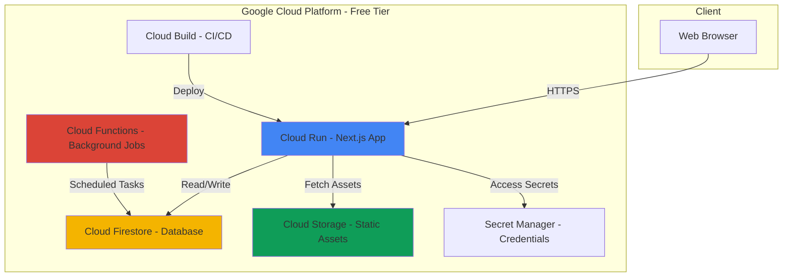

# ☁️ Google Cloud Platform Deployment Guide - Free Tier

## Overview

This guide provides a complete deployment strategy for the Carbon Footprint Platform using Google Cloud Platform's **Always Free** tier, ensuring zero hosting costs for the MVP.

---

## 🆓 GCP Free Tier Resources

### What's Included (Always Free)

| Service | Free Tier Limit | Usage for MVP |
|---------|----------------|---------------|
| **Cloud Run** | 2 million requests/month, 360,000 GB-seconds | Frontend + API hosting |
| **Cloud SQL** | Not free, but alternatives available | Use Cloud Firestore instead |
| **Firestore** | 1 GB storage, 50K reads, 20K writes/day | Primary database |
| **Cloud Storage** | 5 GB storage, 5K Class A operations | Static assets, images |
| **Cloud Build** | 120 build-minutes/day | CI/CD pipeline |
| **Cloud Functions** | 2 million invocations/month | Background jobs |
| **Secret Manager** | 6 active secrets | API keys, credentials |
| **Cloud Logging** | 50 GB logs/month | Application monitoring |

**Total Monthly Cost: $0** (within free tier limits)

---

## 🏗️ Updated Architecture for GCP



---

## 📊 Database Strategy: Firestore vs PostgreSQL

### Why Firestore for Free Tier?

**Advantages:**
- ✅ Completely free within generous limits
- ✅ NoSQL flexibility for MVP iteration
- ✅ Real-time capabilities
- ✅ Automatic scaling
- ✅ No server management

**Trade-offs:**
- ❌ Different query patterns than SQL
- ❌ No complex joins (design around it)
- ❌ Different data modeling approach

### Firestore Data Model

```
users/
  {userId}/
    - email, name, avatarUrl, createdAt
    
    profile/
      - carbonScore, baselineEmissions, goals
    
    activities/
      {activityId}/
        - category, type, amount, emissions, date
    
    insights/
      {insightId}/
        - type, title, description, isRead
    
    challenges/
      {challengeId}/
        - status, progress, startDate, endDate
    
    achievements/
      {achievementId}/
        - badgeType, badgeName, earnedAt

challenges/ (global)
  {challengeId}/
    - title, description, duration, target

emissionFactors/ (global)
  {factorId}/
    - category, type, factor, unit, region

communityPosts/
  {postId}/
    - userId, content, type, likes, createdAt
```

---

## 🚀 Step-by-Step GCP Setup

### Step 1: Create GCP Project

```bash
# Install Google Cloud SDK
# Visit: https://cloud.google.com/sdk/docs/install

# Login to GCP
gcloud auth login

# Create new project
gcloud projects create carbon-footprint-tracker --name="Carbon Footprint Tracker"

# Set as active project
gcloud config set project carbon-footprint-tracker

# Enable required APIs
gcloud services enable \
  run.googleapis.com \
  cloudbuild.googleapis.com \
  firestore.googleapis.com \
  storage.googleapis.com \
  cloudfunctions.googleapis.com \
  secretmanager.googleapis.com
```

### Step 2: Set Up Firestore

```bash
# Create Firestore database in Native mode
gcloud firestore databases create --location=us-central1

# Note: Choose location closest to your users
# Free tier locations: us-central1, us-east1, us-west1
```

### Step 3: Configure Cloud Storage

```bash
# Create bucket for static assets
gsutil mb -l us-central1 gs://carbon-tracker-assets

# Set public access for static files
gsutil iam ch allUsers:objectViewer gs://carbon-tracker-assets

# Create bucket for backups
gsutil mb -l us-central1 gs://carbon-tracker-backups
```

### Step 4: Set Up Secret Manager

```bash
# Create secrets for sensitive data
echo -n "your-nextauth-secret" | gcloud secrets create nextauth-secret --data-file=-

# Add more secrets as needed
echo -n "your-api-key" | gcloud secrets create api-key --data-file=-

# Grant Cloud Run access to secrets
gcloud secrets add-iam-policy-binding nextauth-secret \
  --member="serviceAccount:PROJECT_NUMBER-compute@developer.gserviceaccount.com" \
  --role="roles/secretmanager.secretAccessor"
```

---

## 💻 Updated Technology Stack for GCP

### Frontend & Backend
- **Framework**: Next.js 14 (App Router)
- **Language**: TypeScript
- **Styling**: Tailwind CSS + shadcn/ui
- **Database SDK**: Firebase Admin SDK
- **Auth**: NextAuth.js with Firestore adapter
- **Hosting**: Cloud Run

### Database
- **Primary DB**: Cloud Firestore (NoSQL)
- **Caching**: In-memory (Node.js) or Redis Cloud (free tier)
- **Storage**: Cloud Storage

### DevOps
- **CI/CD**: Cloud Build
- **Monitoring**: Cloud Logging (free tier)
- **Error Tracking**: Cloud Error Reporting (free tier)

---

## 📝 Updated Project Structure

```
carbon-footprint-tracker/
├── app/                    # Next.js app directory
├── components/             # React components
├── lib/
│   ├── firebase/
│   │   ├── config.ts      # Firebase configuration
│   │   ├── admin.ts       # Firebase Admin SDK
│   │   └── client.ts      # Firebase Client SDK
│   ├── services/
│   │   ├── carbon-calculator.ts
│   │   ├── insights-generator.ts
│   │   └── firestore-service.ts
│   └── utils/
├── public/                 # Static assets
├── cloudbuild.yaml        # Cloud Build configuration
├── Dockerfile             # Container configuration
├── .env.example           # Environment variables template
└── firestore.rules        # Firestore security rules
```

---

## 🔧 Configuration Files

### 1. Firebase Configuration

Create `lib/firebase/config.ts`:

```typescript
import { initializeApp, getApps } from 'firebase/app'
import { getFirestore } from 'firebase/firestore'
import { getStorage } from 'firebase/storage'

const firebaseConfig = {
  apiKey: process.env.NEXT_PUBLIC_FIREBASE_API_KEY,
  authDomain: process.env.NEXT_PUBLIC_FIREBASE_AUTH_DOMAIN,
  projectId: process.env.NEXT_PUBLIC_FIREBASE_PROJECT_ID,
  storageBucket: process.env.NEXT_PUBLIC_FIREBASE_STORAGE_BUCKET,
  messagingSenderId: process.env.NEXT_PUBLIC_FIREBASE_MESSAGING_SENDER_ID,
  appId: process.env.NEXT_PUBLIC_FIREBASE_APP_ID,
}

// Initialize Firebase
const app = getApps().length === 0 ? initializeApp(firebaseConfig) : getApps()[0]
const db = getFirestore(app)
const storage = getStorage(app)

export { app, db, storage }
```

### 2. Firebase Admin SDK

Create `lib/firebase/admin.ts`:

```typescript
import { initializeApp, getApps, cert } from 'firebase-admin/app'
import { getFirestore } from 'firebase-admin/firestore'

if (!getApps().length) {
  initializeApp({
    credential: cert({
      projectId: process.env.FIREBASE_PROJECT_ID,
      clientEmail: process.env.FIREBASE_CLIENT_EMAIL,
      privateKey: process.env.FIREBASE_PRIVATE_KEY?.replace(/\\n/g, '\n'),
    }),
  })
}

const adminDb = getFirestore()

export { adminDb }
```

### 3. Dockerfile

Create `Dockerfile`:

```dockerfile
FROM node:20-alpine AS base

# Install dependencies only when needed
FROM base AS deps
RUN apk add --no-cache libc6-compat
WORKDIR /app

COPY package.json package-lock.json* ./
RUN npm ci

# Rebuild the source code only when needed
FROM base AS builder
WORKDIR /app
COPY --from=deps /app/node_modules ./node_modules
COPY . .

ENV NEXT_TELEMETRY_DISABLED 1

RUN npm run build

# Production image, copy all the files and run next
FROM base AS runner
WORKDIR /app

ENV NODE_ENV production
ENV NEXT_TELEMETRY_DISABLED 1

RUN addgroup --system --gid 1001 nodejs
RUN adduser --system --uid 1001 nextjs

COPY --from=builder /app/public ./public
COPY --from=builder --chown=nextjs:nodejs /app/.next/standalone ./
COPY --from=builder --chown=nextjs:nodejs /app/.next/static ./.next/static

USER nextjs

EXPOSE 8080

ENV PORT 8080
ENV HOSTNAME "0.0.0.0"

CMD ["node", "server.js"]
```

### 4. Cloud Build Configuration

Create `cloudbuild.yaml`:

```yaml
steps:
  # Build the container image
  - name: 'gcr.io/cloud-builders/docker'
    args: ['build', '-t', 'gcr.io/$PROJECT_ID/carbon-tracker:$COMMIT_SHA', '.']
  
  # Push the container image to Container Registry
  - name: 'gcr.io/cloud-builders/docker'
    args: ['push', 'gcr.io/$PROJECT_ID/carbon-tracker:$COMMIT_SHA']
  
  # Deploy container image to Cloud Run
  - name: 'gcr.io/google.com/cloudsdktool/cloud-sdk'
    entrypoint: gcloud
    args:
      - 'run'
      - 'deploy'
      - 'carbon-tracker'
      - '--image'
      - 'gcr.io/$PROJECT_ID/carbon-tracker:$COMMIT_SHA'
      - '--region'
      - 'us-central1'
      - '--platform'
      - 'managed'
      - '--allow-unauthenticated'
      - '--memory'
      - '512Mi'
      - '--cpu'
      - '1'
      - '--max-instances'
      - '10'
      - '--set-env-vars'
      - 'NODE_ENV=production'
      - '--set-secrets'
      - 'NEXTAUTH_SECRET=nextauth-secret:latest'

images:
  - 'gcr.io/$PROJECT_ID/carbon-tracker:$COMMIT_SHA'

options:
  machineType: 'E2_HIGHCPU_8'
```

### 5. Firestore Security Rules

Create `firestore.rules`:

```javascript
rules_version = '2';
service cloud.firestore {
  match /databases/{database}/documents {
    // Helper functions
    function isAuthenticated() {
      return request.auth != null;
    }
    
    function isOwner(userId) {
      return isAuthenticated() && request.auth.uid == userId;
    }
    
    // Users collection
    match /users/{userId} {
      allow read: if isAuthenticated();
      allow write: if isOwner(userId);
      
      // User subcollections
      match /{document=**} {
        allow read, write: if isOwner(userId);
      }
    }
    
    // Global challenges (read-only for users)
    match /challenges/{challengeId} {
      allow read: if isAuthenticated();
      allow write: if false; // Only admins via backend
    }
    
    // Emission factors (read-only)
    match /emissionFactors/{factorId} {
      allow read: if true;
      allow write: if false;
    }
    
    // Community posts
    match /communityPosts/{postId} {
      allow read: if isAuthenticated();
      allow create: if isAuthenticated();
      allow update, delete: if isAuthenticated() && 
        resource.data.userId == request.auth.uid;
    }
  }
}
```

---

## 🚀 Deployment Process

### Initial Deployment

```bash
# 1. Build and deploy to Cloud Run
gcloud run deploy carbon-tracker \
  --source . \
  --region us-central1 \
  --platform managed \
  --allow-unauthenticated \
  --memory 512Mi \
  --cpu 1 \
  --max-instances 10 \
  --set-env-vars NODE_ENV=production \
  --set-secrets NEXTAUTH_SECRET=nextauth-secret:latest

# 2. Get the service URL
gcloud run services describe carbon-tracker \
  --region us-central1 \
  --format 'value(status.url)'
```

### Set Up CI/CD with Cloud Build

```bash
# 1. Connect GitHub repository
gcloud builds triggers create github \
  --repo-name=carbon-footprint-tracker \
  --repo-owner=YOUR_GITHUB_USERNAME \
  --branch-pattern="^main$" \
  --build-config=cloudbuild.yaml

# 2. Grant Cloud Build permissions
PROJECT_NUMBER=$(gcloud projects describe carbon-footprint-tracker --format='value(projectNumber)')

gcloud projects add-iam-policy-binding carbon-footprint-tracker \
  --member="serviceAccount:${PROJECT_NUMBER}@cloudbuild.gserviceaccount.com" \
  --role="roles/run.admin"

gcloud projects add-iam-policy-binding carbon-footprint-tracker \
  --member="serviceAccount:${PROJECT_NUMBER}@cloudbuild.gserviceaccount.com" \
  --role="roles/iam.serviceAccountUser"
```

---

## 📦 Updated Dependencies

```json
{
  "dependencies": {
    "next": "14.0.0",
    "react": "18.2.0",
    "react-dom": "18.2.0",
    "typescript": "5.3.0",
    
    "firebase": "^10.7.0",
    "firebase-admin": "^12.0.0",
    
    "next-auth": "^5.0.0-beta",
    "@auth/firebase-adapter": "^1.0.0",
    
    "zod": "^3.22.0",
    "date-fns": "^3.0.0",
    "recharts": "^2.10.0",
    "zustand": "^4.4.0",
    
    "@radix-ui/react-dialog": "^1.0.5",
    "@radix-ui/react-dropdown-menu": "^2.0.6",
    "class-variance-authority": "^0.7.0",
    "clsx": "^2.0.0",
    "tailwind-merge": "^2.0.0",
    "lucide-react": "^0.294.0"
  }
}
```

---

## 🔄 Data Migration Strategy

### Firestore Collections Structure

```typescript
// User document
interface User {
  id: string
  email: string
  name: string
  avatarUrl?: string
  createdAt: Timestamp
  updatedAt: Timestamp
}

// User profile subcollection
interface UserProfile {
  carbonScore: number
  baselineEmissions: number
  reductionGoalPercentage?: number
  goalDeadline?: Timestamp
  country?: string
  city?: string
  householdSize?: number
}

// Activity document
interface Activity {
  id: string
  category: 'transport' | 'food' | 'energy' | 'shopping'
  activityType: string
  amount: number
  unit: string
  emissionsKg: number
  date: Timestamp
  notes?: string
  createdAt: Timestamp
}
```

### Seed Data Script

Create `scripts/seed-firestore.ts`:

```typescript
import { adminDb } from '@/lib/firebase/admin'

async function seedEmissionFactors() {
  const factorsRef = adminDb.collection('emissionFactors')
  
  const factors = [
    {
      category: 'transport',
      activityType: 'car_petrol',
      factorKgCo2: 0.192,
      unit: 'km',
      source: 'EPA',
      region: 'US',
    },
    // Add more factors...
  ]
  
  for (const factor of factors) {
    await factorsRef.add(factor)
  }
  
  console.log('Emission factors seeded!')
}

async function seedChallenges() {
  const challengesRef = adminDb.collection('challenges')
  
  const challenges = [
    {
      title: 'Car-Free Week',
      description: 'Avoid using your car for 7 days',
      category: 'transport',
      durationDays: 7,
      targetReductionKg: 30,
      badgeIcon: '🚲',
      isActive: true,
    },
    // Add more challenges...
  ]
  
  for (const challenge of challenges) {
    await challengesRef.add(challenge)
  }
  
  console.log('Challenges seeded!')
}

async function main() {
  await seedEmissionFactors()
  await seedChallenges()
}

main()
```

---

## 📊 Monitoring & Optimization

### Cloud Logging Queries

```bash
# View application logs
gcloud logging read "resource.type=cloud_run_revision AND resource.labels.service_name=carbon-tracker" --limit 50

# View error logs
gcloud logging read "resource.type=cloud_run_revision AND severity>=ERROR" --limit 20

# View request logs
gcloud logging read "httpRequest.requestUrl=~\"api\"" --limit 30
```

### Performance Optimization

1. **Enable Firestore Indexes**
```bash
# Create composite indexes for common queries
firebase deploy --only firestore:indexes
```

2. **Optimize Cloud Run**
```bash
# Update service with optimizations
gcloud run services update carbon-tracker \
  --region us-central1 \
  --min-instances 0 \
  --max-instances 10 \
  --cpu-throttling \
  --memory 512Mi
```

3. **CDN for Static Assets**
```bash
# Enable Cloud CDN (requires Cloud Load Balancer - not free)
# Alternative: Use Cloud Storage with public access
```

---

## 💰 Cost Monitoring

### Stay Within Free Tier

**Daily Limits to Monitor:**
- Firestore reads: < 50,000/day
- Firestore writes: < 20,000/day
- Cloud Run requests: < 66,000/day (2M/month)
- Cloud Build: < 120 minutes/day

### Set Up Budget Alerts

```bash
# Create budget alert
gcloud billing budgets create \
  --billing-account=BILLING_ACCOUNT_ID \
  --display-name="Carbon Tracker Budget" \
  --budget-amount=5 \
  --threshold-rule=percent=50 \
  --threshold-rule=percent=90 \
  --threshold-rule=percent=100
```

---

## 🔒 Security Best Practices

1. **Firestore Security Rules** - Already configured above
2. **Secret Management** - Use Secret Manager for all credentials
3. **CORS Configuration** - Configure in Cloud Run
4. **Rate Limiting** - Implement in application code
5. **Authentication** - NextAuth.js with Firestore adapter

---

## 📈 Scaling Strategy

### When to Upgrade from Free Tier

**Indicators:**
- > 50K Firestore reads/day consistently
- > 2M Cloud Run requests/month
- Need for Cloud SQL (relational database)
- Need for Redis caching
- Need for Cloud CDN

**Estimated Costs After Free Tier:**
- Cloud Run: ~$5-10/month (100K requests)
- Firestore: ~$5-15/month (additional reads/writes)
- Cloud Storage: ~$1-5/month
- **Total: ~$11-30/month**

---

## 🚀 Quick Start Commands

```bash
# 1. Clone and setup
git clone <your-repo>
cd carbon-footprint-tracker
npm install

# 2. Set up environment variables
cp .env.example .env.local
# Fill in Firebase credentials

# 3. Run locally
npm run dev

# 4. Deploy to GCP
gcloud run deploy carbon-tracker --source .

# 5. View logs
gcloud run logs read carbon-tracker --region us-central1
```

---

## 📚 Additional Resources

- [Cloud Run Documentation](https://cloud.google.com/run/docs)
- [Firestore Documentation](https://firebase.google.com/docs/firestore)
- [Cloud Build Documentation](https://cloud.google.com/build/docs)
- [GCP Free Tier](https://cloud.google.com/free)

---

**Document Version:** 1.0  
**Created:** June 12, 2026  
**Status:** GCP Deployment Guide  
**Estimated Monthly Cost:** $0 (within free tier)