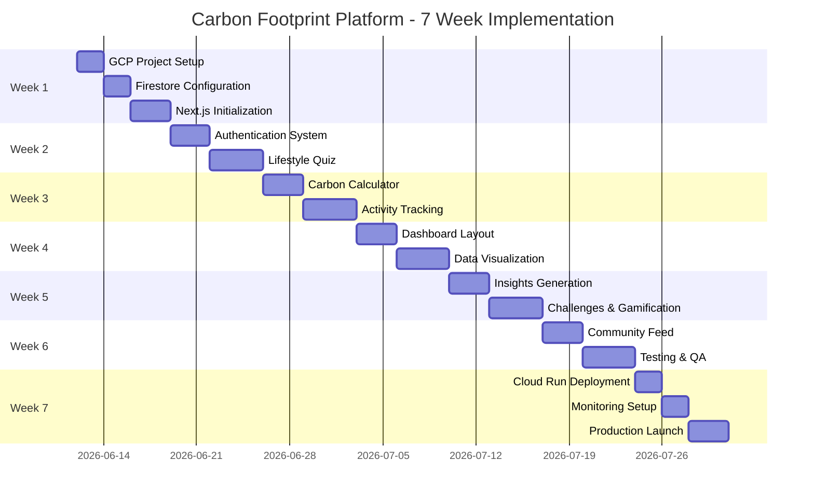
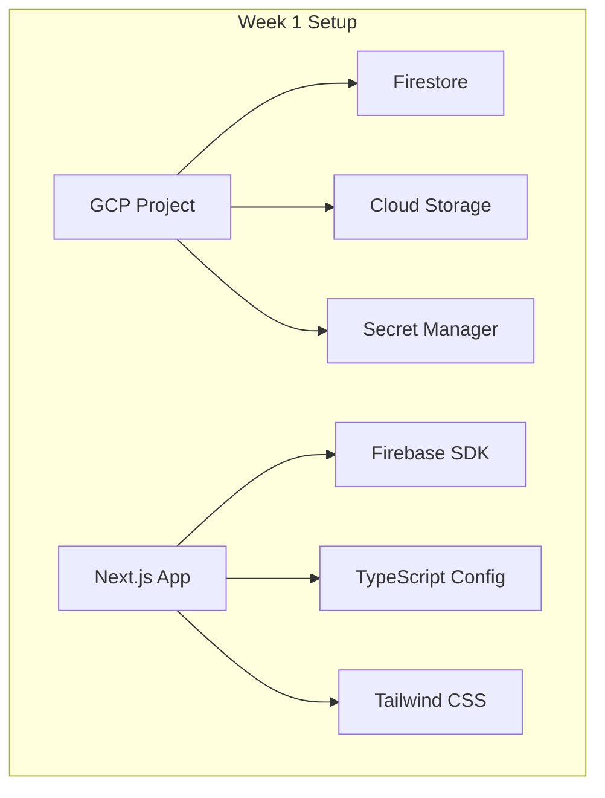
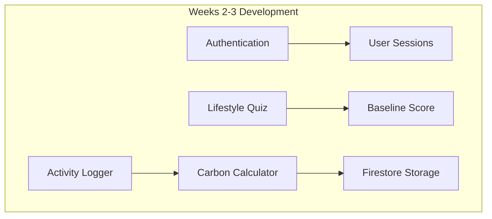
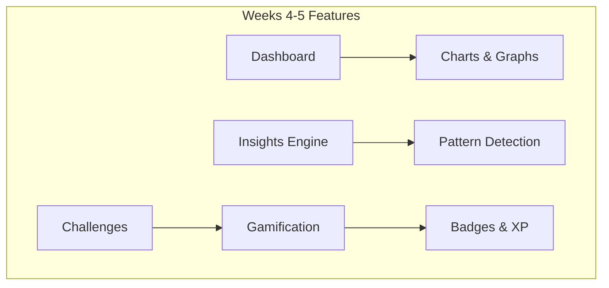
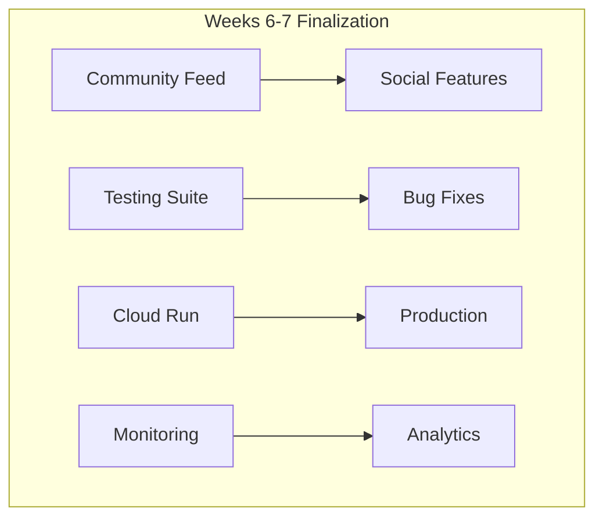
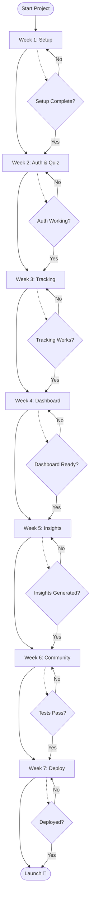
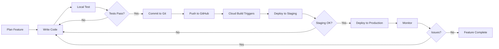
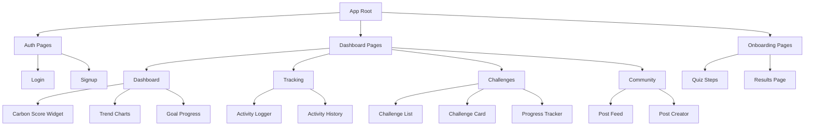
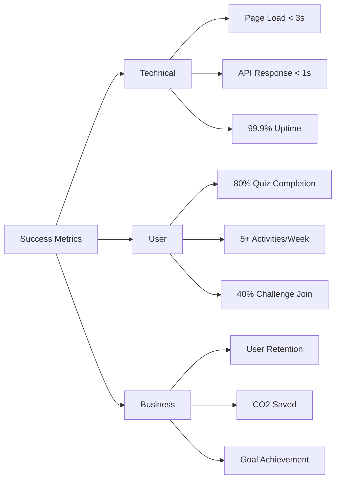

# 🗺️ Implementation Roadmap - Carbon Footprint Platform

> **Visual guide to the 7-week implementation journey on GCP Free Tier**

---

## 📅 Timeline Overview

---

## 🏗️ Architecture Evolution

### Week 1: Foundation

### Week 2-3: Core Features

### Week 4-5: Advanced Features

### Week 6-7: Polish & Deploy

---

## 🎯 Feature Implementation Flow

---

## 📊 Weekly Deliverables

### Week 1: Foundation ✅
- [ ] GCP project with all APIs enabled
- [ ] Firestore database configured
- [ ] Next.js app running locally
- [ ] CI/CD pipeline set up
- [ ] Environment variables configured

**Success Criteria**: Can run `npm run dev` and see Next.js app

---

### Week 2: Authentication & Onboarding ✅
- [ ] Login/signup pages functional
- [ ] NextAuth.js configured
- [ ] Protected routes working
- [ ] Lifestyle quiz complete
- [ ] Baseline carbon score calculated

**Success Criteria**: User can sign up, complete quiz, and see their baseline score

---

### Week 3: Carbon Calculator & Tracking ✅
- [ ] Carbon calculation engine working
- [ ] Activity logging UI complete
- [ ] Activities saved to Firestore
- [ ] Activity history viewable
- [ ] Edit/delete functionality

**Success Criteria**: User can log activities and see emissions calculated

---

### Week 4: Dashboard & Visualization ✅
- [ ] Dashboard layout complete
- [ ] Carbon score widget
- [ ] Trend charts (Recharts)
- [ ] Category breakdown
- [ ] Goal progress tracking

**Success Criteria**: User can view their carbon footprint data visually

---

### Week 5: Insights & Challenges ✅
- [ ] Insights generation algorithm
- [ ] Personalized tips displayed
- [ ] Challenge enrollment system
- [ ] Progress tracking
- [ ] Badge/achievement system

**Success Criteria**: User receives insights and can join challenges

---

### Week 6: Community & Testing ✅
- [ ] Community feed functional
- [ ] Post creation/viewing
- [ ] Like functionality
- [ ] Unit tests written
- [ ] E2E tests passing

**Success Criteria**: All features tested and working

---

### Week 7: Deployment & Launch ✅
- [ ] Deployed to Cloud Run
- [ ] Custom domain configured (optional)
- [ ] Monitoring set up
- [ ] Error tracking active
- [ ] Documentation complete

**Success Criteria**: App live and accessible at production URL

---

## 🔄 Development Workflow

---

## 🎨 Component Hierarchy

---

## 📈 Progress Tracking

### Implementation Checklist

#### Infrastructure (Week 1)
- [ ] GCP project created
- [ ] APIs enabled
- [ ] Service accounts configured
- [ ] Firestore initialized
- [ ] Security rules deployed
- [ ] Indexes created
- [ ] Seed data loaded
- [ ] Next.js project initialized
- [ ] Dependencies installed
- [ ] Docker configured
- [ ] CI/CD pipeline set up

#### Authentication (Week 2)
- [ ] NextAuth.js configured
- [ ] Login page created
- [ ] Signup page created
- [ ] Session management working
- [ ] Protected routes configured
- [ ] User profile creation

#### Onboarding (Week 2)
- [ ] Quiz questions defined
- [ ] Quiz UI components
- [ ] Multi-step form
- [ ] Progress indicator
- [ ] Baseline calculation
- [ ] Results page
- [ ] Goal setting

#### Activity Tracking (Week 3)
- [ ] Carbon calculator service
- [ ] Emission factors loaded
- [ ] Activity form UI
- [ ] Quick-add buttons
- [ ] Activity history view
- [ ] Edit functionality
- [ ] Delete functionality
- [ ] Date picker

#### Dashboard (Week 4)
- [ ] Dashboard layout
- [ ] Carbon score widget
- [ ] Daily tracker
- [ ] Weekly trends chart
- [ ] Monthly trends chart
- [ ] Category breakdown
- [ ] Goal progress bar
- [ ] Comparison widgets

#### Insights (Week 5)
- [ ] Pattern detection algorithm
- [ ] Insight generation
- [ ] Tip recommendations
- [ ] Insight display UI
- [ ] Read/unread tracking
- [ ] Insight prioritization
- [ ] Cloud Function scheduled

#### Challenges (Week 5)
- [ ] Challenge templates
- [ ] Enrollment system
- [ ] Progress tracking
- [ ] Badge system
- [ ] Achievement tracking
- [ ] Streak counter
- [ ] XP system
- [ ] Leaderboard (optional)

#### Community (Week 6)
- [ ] Post creation UI
- [ ] Post feed
- [ ] Like functionality
- [ ] Post filtering
- [ ] User profiles
- [ ] Moderation rules

#### Testing (Week 6)
- [ ] Unit tests for calculator
- [ ] Unit tests for insights
- [ ] API route tests
- [ ] Component tests
- [ ] E2E test scenarios
- [ ] Performance tests
- [ ] Security tests

#### Deployment (Week 7)
- [ ] Staging deployment
- [ ] Environment variables set
- [ ] Secrets configured
- [ ] Production deployment
- [ ] Custom domain (optional)
- [ ] SSL certificate
- [ ] Monitoring configured
- [ ] Error tracking
- [ ] Analytics set up
- [ ] Documentation complete

---

## 🎯 Success Metrics Dashboard

---

## 🚀 Launch Checklist

### Pre-Launch
- [ ] All features tested
- [ ] Performance optimized
- [ ] Security audit complete
- [ ] Documentation updated
- [ ] Backup strategy in place
- [ ] Monitoring configured
- [ ] Error tracking active
- [ ] Analytics set up

### Launch Day
- [ ] Deploy to production
- [ ] Verify all features work
- [ ] Monitor error rates
- [ ] Check performance metrics
- [ ] Test user flows
- [ ] Announce launch

### Post-Launch
- [ ] Monitor user feedback
- [ ] Track key metrics
- [ ] Fix critical bugs
- [ ] Plan improvements
- [ ] Gather analytics
- [ ] Iterate on features

---

## 📚 Resources by Week

### Week 1 Resources
- [GCP Free Tier Documentation](https://cloud.google.com/free)
- [Firestore Setup Guide](https://firebase.google.com/docs/firestore/quickstart)
- [Next.js 14 Documentation](https://nextjs.org/docs)

### Week 2 Resources
- [NextAuth.js Documentation](https://next-auth.js.org)
- [React Hook Form Guide](https://react-hook-form.com)
- [Zod Validation](https://zod.dev)

### Week 3 Resources
- [EPA Emission Factors](https://www.epa.gov/climateleadership/ghg-emission-factors-hub)
- [Carbon Calculation Methods](https://www.carbonfootprint.com/calculator.aspx)

### Week 4 Resources
- [Recharts Documentation](https://recharts.org)
- [Data Visualization Best Practices](https://www.tableau.com/learn/articles/data-visualization)

### Week 5 Resources
- [Gamification Principles](https://www.gamify.com)
- [Pattern Recognition Algorithms](https://en.wikipedia.org/wiki/Pattern_recognition)

### Week 6 Resources
- [Vitest Documentation](https://vitest.dev)
- [Playwright Documentation](https://playwright.dev)

### Week 7 Resources
- [Cloud Run Best Practices](https://cloud.google.com/run/docs/tips)
- [Cloud Monitoring Guide](https://cloud.google.com/monitoring/docs)

---

## 🎉 Milestone Celebrations

- **Week 1 Complete**: 🎊 Foundation is solid!
- **Week 2 Complete**: 🔐 Users can sign up and get assessed!
- **Week 3 Complete**: 📊 Activity tracking is live!
- **Week 4 Complete**: 📈 Beautiful visualizations!
- **Week 5 Complete**: 🎮 Gamification is fun!
- **Week 6 Complete**: ✅ Everything tested!
- **Week 7 Complete**: 🚀 **WE'RE LIVE!**

---

**Ready to start your journey? Follow the [GCP_STEP_BY_STEP_GUIDE.md](./GCP_STEP_BY_STEP_GUIDE.md) for detailed instructions!**

**💚 Let's build something that makes a difference! 🌍**