# 🏗️ Carbon Footprint Platform - Technical Architecture

## System Architecture Diagram

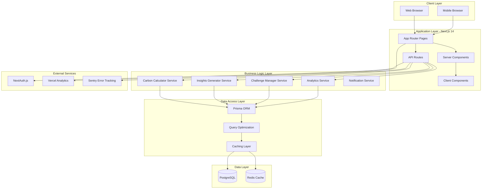

## Data Flow Architecture

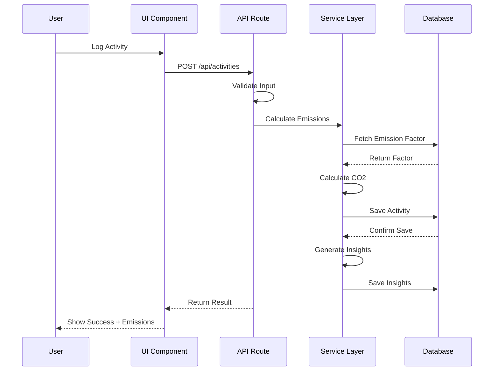

## Database Schema Relationships

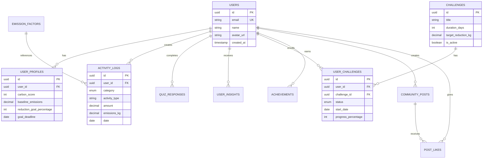

## API Architecture

```mermaid
graph LR
    subgraph "API Routes Structure"
        A[/api/auth/*]
        B[/api/activities/*]
        C[/api/quiz/*]
        D[/api/insights/*]
        E[/api/challenges/*]
        F[/api/community/*]
        G[/api/dashboard/*]
        H[/api/calculations/*]
    end
    
    subgraph "Middleware"
        I[Authentication]
        J[Rate Limiting]
        K[Validation]
        L[Error Handling]
    end
    
    A --> I
    B --> I
    C --> I
    D --> I
    E --> I
    F --> I
    G --> I
    H --> I
    
    I --> J
    J --> K
    K --> L
```

## Component Architecture

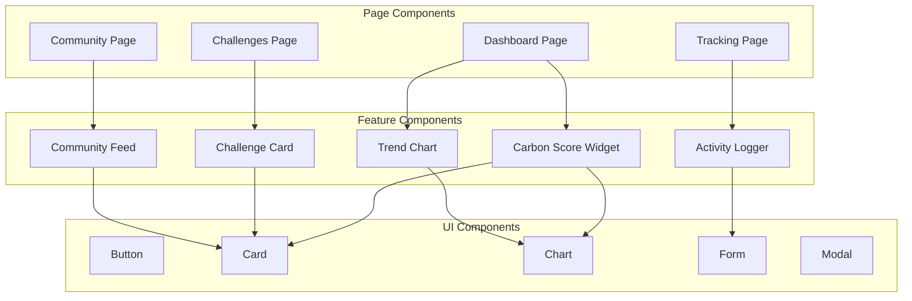

## Authentication Flow

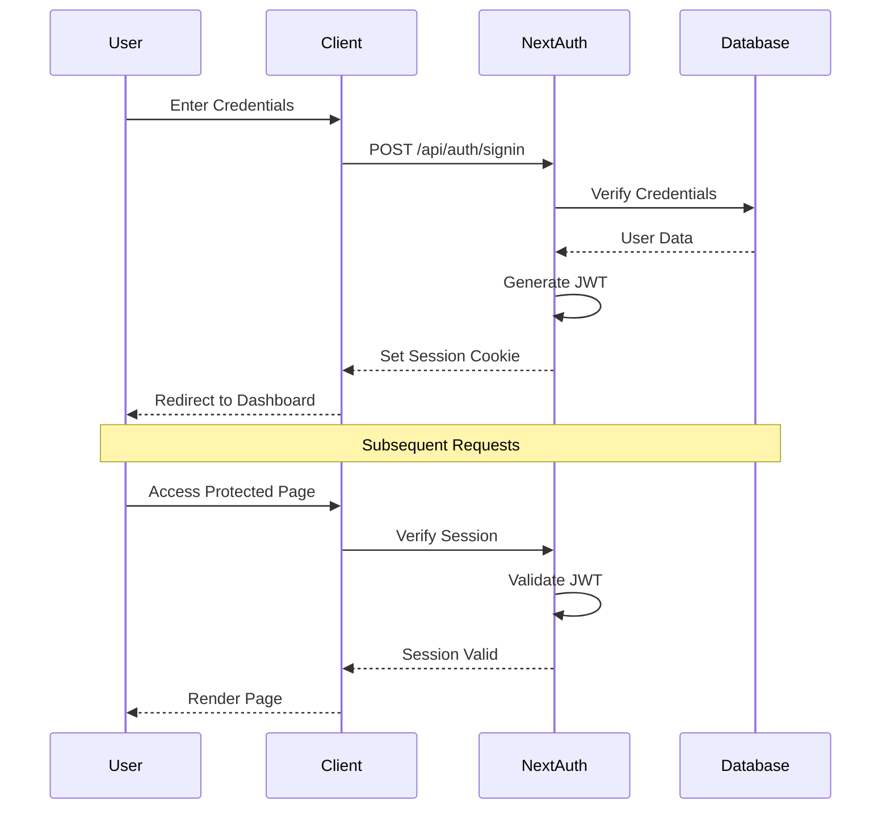

## Carbon Calculation Flow

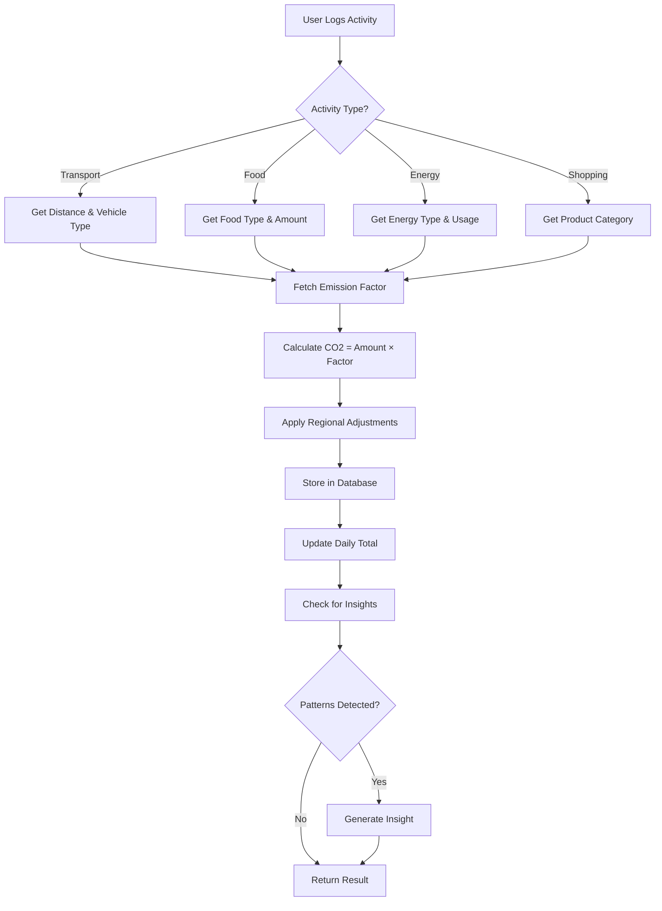

## Insights Generation Flow

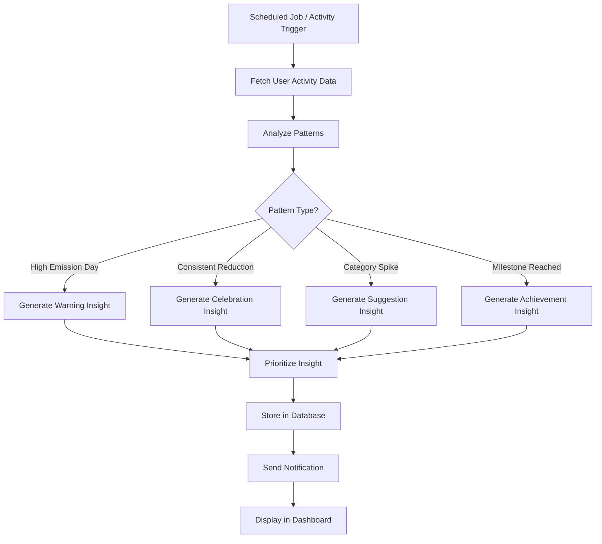

## Challenge Progress Tracking

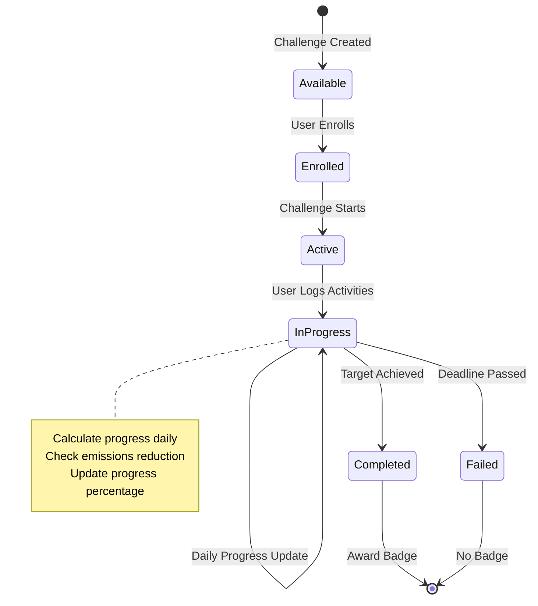

## Deployment Architecture

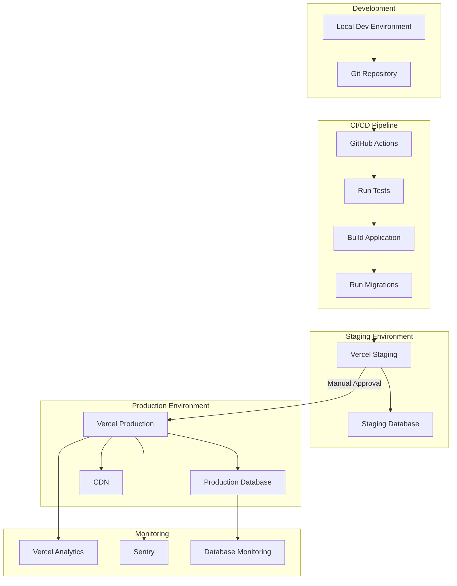

## Caching Strategy

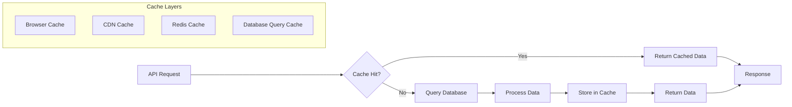

## Security Architecture

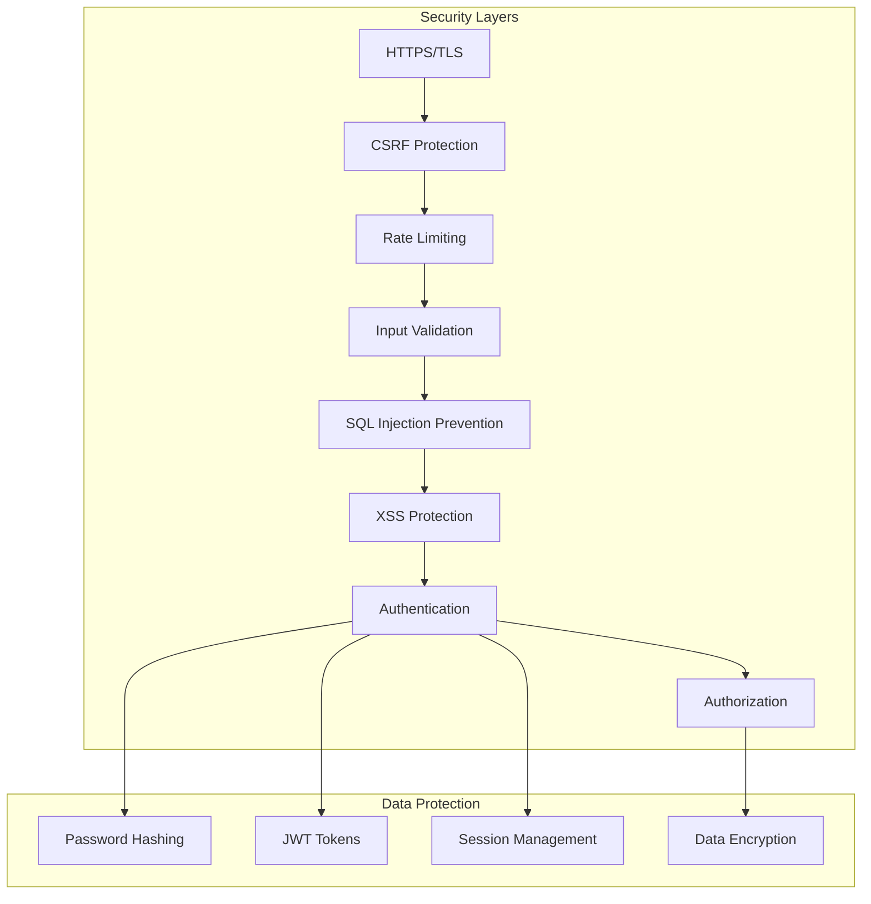

## Performance Optimization Strategy

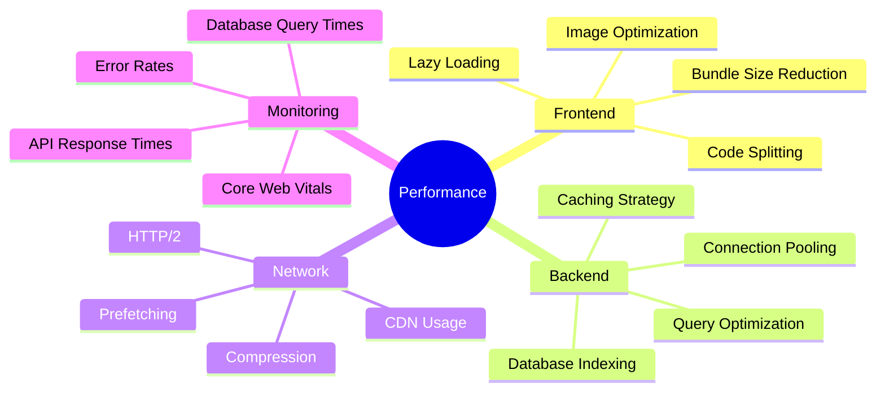

## Scalability Considerations

### Horizontal Scaling
- Stateless API design
- Database connection pooling
- Redis for session storage
- CDN for static assets

### Vertical Scaling
- Database optimization
- Query performance tuning
- Efficient indexing
- Caching strategies

### Load Distribution
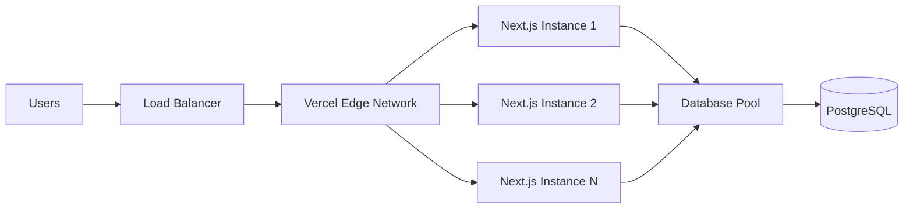

## Monitoring & Observability

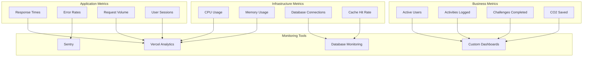

---

**Document Version:** 1.0  
**Created:** June 12, 2026  
**Status:** Technical Reference